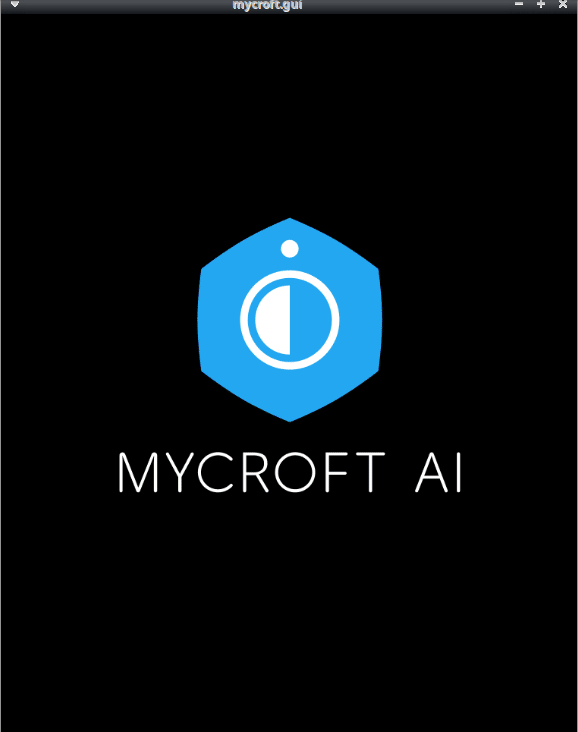

#  OVOS - Pairing
Connect your device to the Mycroft server - [Home](https://home.mycroft.ai/)

## About 
 The default backend to provide services for Mycroft users is
 [Home](https://home.mycroft.ai/).  Pairing a device with Home provides access
 to privacy-protecting Speech to Text, Wolfram Alpha and other such services,
 as well as easy configuration for all your Mycroft devices.

This fork provides extra configuration options for other vendors to easily 
change color scheme and pairing url, it also uses different GUI screens. We 
found that the timing of the pairing dialogs did not make sense because it 
said mycroft was ready before he was, causing users to try talking to it 
before it fully loaded

## Examples 
* "Pair my device" (happens automatically on first run if not paired already)

## Credits 
Mycroft AI (@MycroftAI)

## Category
**Configuration**

## Tags
#pair
#pairing
#connectivity
#system
